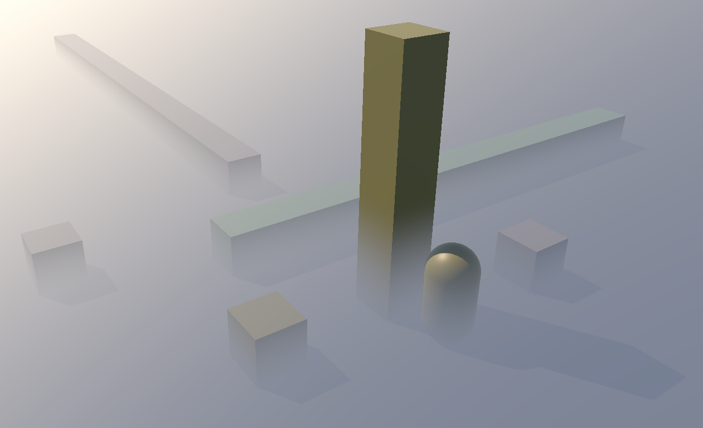

# Minor extended version of meryuhi's Simple Fog Effects For URP

Fork of [meyuhi's URP Fog Effect](https://github.com/meryuhi/URPFog) that adds the option for dual color blending for a crude, but cheap approximation of atmospheric scattering of sunlight. 

See the parent repository for more details.

## License
This project is under the MIT License.
